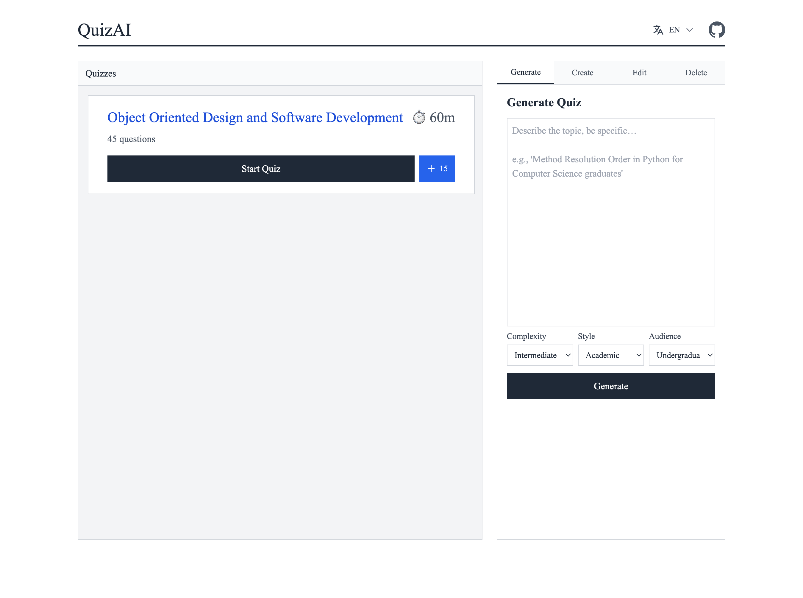
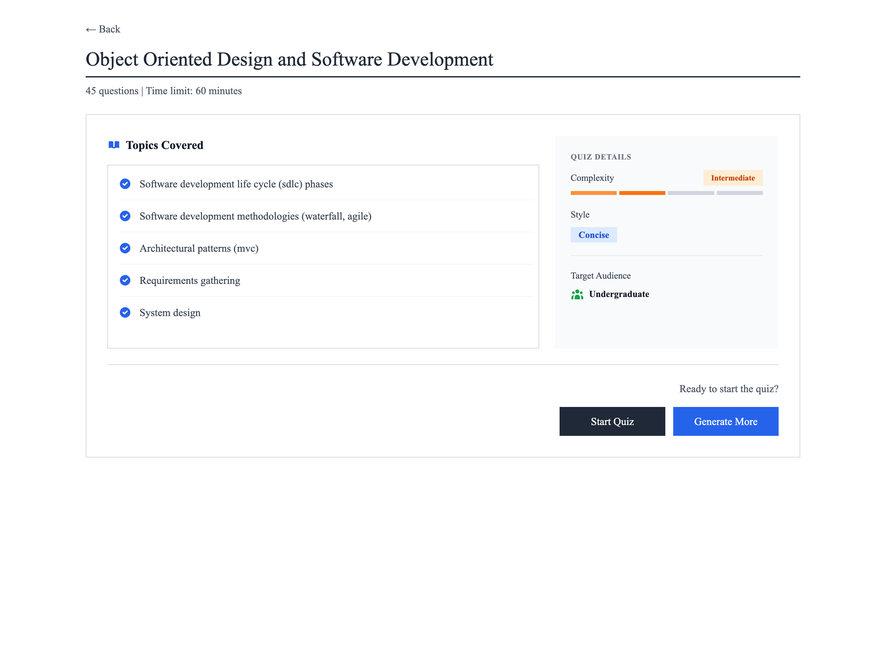
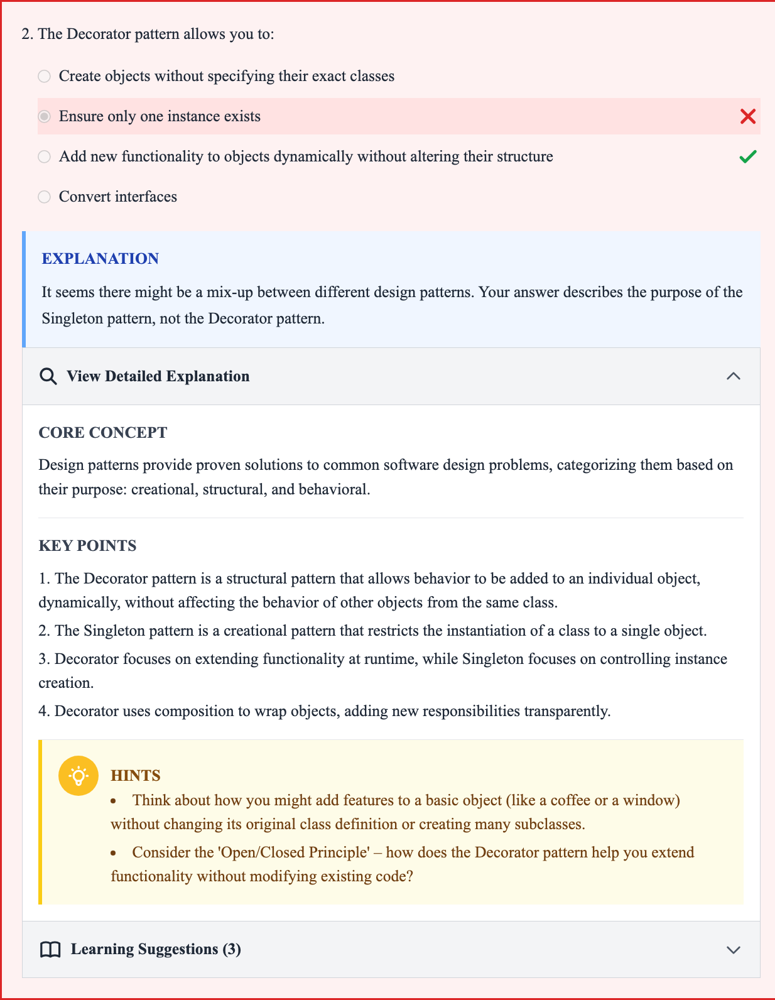

# QuizAI

An agentic AI-powered quiz platform built with FastAPI and OpenRouter AI for intelligent quiz generation, answer evaluation, and question augmentation. Features autonomous agents that orchestrate specialized tools to create, evaluate, and enhance educational quizzes.

## Screenshots

<div align="center">
  
  
</div>

<div align="center">
  
  
  
</div>

## Features

- **Autonomous Quiz Generation** - Generate complete quizzes from topic descriptions using AI agents
- **AI-Powered Evaluation** - Expert feedback with detailed explanations, core concepts, key points, and hints
- **Question Augmentation** - Generate additional questions matching existing quiz style and characteristics
- **Internationalization** - Support for 19 languages with session-based preference storage
- **Quiz Management** - Upload markdown files, paste content, generate from descriptions, edit, and delete quizzes
- **Session Tracking** - Persistent sessions with localStorage and server-side session management
- **Learning Profile** - Track topic proficiencies and error patterns across quiz attempts
- **Personalized Suggestions** - Context-aware learning suggestions based on quiz characteristics and performance
- **Timer Support** - Optional time limits with countdown (auto-calculated for generated quizzes)
- **Responsive Design** - Mobile-first UI with Tailwind CSS

## Quick Start

```bash
# Install dependencies
pip install -e .

# Configure
echo "OPENROUTER_API_KEY=your_key_here" > .env

# Run
uvicorn main:app --reload --port 8000
```

Visit [http://localhost:8000](http://localhost:8000)

Get API key at [openrouter.ai](https://openrouter.ai/)

## Quiz Format

```markdown
<Topic Name>

What is Python?
- A snake
> A programming language
- A movie

Which are valid types in Python?
> int
> str
- double

</Topic Name>
```

**Rules:**
- `<Topic>...</Topic>` tags wrap questions
- `-` prefix = incorrect answer
- `>` prefix = correct answer
- Multiple correct answers supported
- Empty line between questions
- **Timed quizzes:** `<Topic:5>` (5 minutes) - colon required, closing tag is `</Topic>`
- **Non-timed quizzes:** `<Topic>` or `<Topic 5>` (number without colon is ignored)

**Multiple topics per file:**
```markdown
<Topic 1:15>
...
</Topic 1>

<Topic 2>
...
</Topic 2>
```

## Project Structure

```
.
├── main.py                      # FastAPI entry point with health check
├── api/
│   ├── config.py                # Configuration
│   ├── dependencies.py          # DI (storage, AI, sessions, caches)
│   ├── i18n.py                  # Translation utilities
│   └── v1/
│       └── quizzes.py           # API endpoints
├── templates/
│   ├── components/
│   │   └── language_selector.html  # Reusable language selector
│   ├── quizzes.html             # Quiz list and management
│   ├── quiz.html                # Quiz taking and results
│   ├── feedback.html            # Structured feedback display
│   └── modal.html               # Shared modal component
├── static/
│   ├── favicon.svg              # Application favicon
│   └── modal.js                 # Modal functions
├── translations/                # i18n JSON files (19 languages)
│   ├── en.json
│   ├── hu.json
│   ├── de.json
│   └── ... (16 more languages)
├── src/
│   ├── models.py                # Data models (Quiz, Question, Choice)
│   ├── parser.py                # Markdown parser with time limit support
│   ├── storage.py               # Persistence (file-based)
│   ├── quiz_ai.py               # Main AI orchestrator
│   └── agents/                  # Agentic AI architecture
│       ├── agent.py             # Base Agent class
│       ├── generator.py         # GeneratorAgent (Workflow 1)
│       ├── augmenter.py         # AugmenterAgent (Workflow 2)
│       ├── evaluator.py         # EvaluatorAgent (Workflow 3)
│       ├── schemas.py           # Data schemas (dataclasses, StrEnums)
│       └── tools/               # Specialized agent tools
│           ├── quiz_profile_extractor.py
│           ├── topic_coverage_planner.py
│           ├── question_generator.py
│           ├── question_validator.py
│           ├── quiz_context_extractor.py
│           ├── topic_coverage_analyzer.py
│           ├── error_evaluator.py
│           ├── pedagogy_extractor.py
│           ├── feedback_generator.py
│           └── suggestions_generator.py
├── quizzes/                     # Quiz files storage
│   └── examples/                # Sample quizzes
├── Dockerfile                   # Docker configuration
├── fly.toml                     # Fly.io deployment config
├── pyproject.toml               # Project metadata
└── requirements.txt             # Python dependencies
```

## API Endpoints

```
POST   /api/v1/quizzes/generate              # Generate quiz from description
POST   /api/v1/quizzes                       # Upload file
POST   /api/v1/quizzes/create                # Create from content
DELETE /api/v1/quizzes                       # Delete all quizzes
GET    /api/v1/quizzes                       # List quizzes
GET    /api/v1/quizzes/{slug}                # Get quiz
GET    /api/v1/quizzes/{slug}/content        # Get raw markdown content
PUT    /api/v1/quizzes/{slug}                # Update quiz content
DELETE /api/v1/quizzes/{slug}                # Delete single quiz
POST   /api/v1/quizzes/{slug}/sessions       # Start session
GET    /api/v1/quizzes/{slug}/sessions/latest        # Get latest session
POST   /api/v1/quizzes/{slug}/sessions/latest/submit # Submit answers
POST   /api/v1/quizzes/{slug}/generate       # Generate +15 questions
POST   /api/v1/quizzes/language              # Set user language preference
GET    /health                               # Health check endpoint
```

All endpoints support JSON/HTML via `Accept` header.

## AI Integration

**Autonomous Quiz Generation (Workflow 1):**
- Generate complete quizzes from topic descriptions
- Automatically infers complexity, style, target audience, domain, and language
- Calculates appropriate time limits based on complexity and question count
- Uses `GeneratorAgent` with tools for profile extraction, coverage planning, question generation, and validation

**Answer Evaluation (Workflow 3):**
- Structured feedback with core concepts, explanations, key points, and hints
- Detailed analysis of misconceptions using error classification
- Learning profile tracking with topic proficiencies
- Personalized suggestions based on quiz context
- Uses `EvaluatorAgent` with tools for context extraction, error evaluation, pedagogical analysis, feedback generation, and suggestions

**Question Augmentation (Workflow 2):**
- Generates additional questions matching existing quiz style
- Analyzes coverage gaps and suggests concepts
- Maintains consistency with original quiz characteristics
- Uses `AugmenterAgent` with tools for context extraction, coverage analysis, question generation, and validation

## Dependencies

- `fastapi>=0.108.0` - Web framework
- `uvicorn>=0.25.0` - ASGI server
- `jinja2>=3.1.2` - Templates
- `openai>=1.0.0` - OpenRouter client
- `python-multipart>=0.0.6` - File uploads
- `python-dotenv>=1.0.0` - Environment variables

## Configuration

Create `.env` file:

```bash
OPENROUTER_API_KEY=your_openrouter_api_key_here
```

Change AI model in `src/quiz_ai.py` or agent initialization:

```python
QuizAI(model="google/gemini-2.5-flash")  # Default
GeneratorAgent(model="google/gemini-2.5-flash")  # For quiz generation
EvaluatorAgent(model="google/gemini-2.5-flash")  # For evaluation
AugmenterAgent(model="google/gemini-2.5-flash")  # For augmentation
```

## Deployment

The application is configured for deployment on Fly.io:

```bash
# Install flyctl
# Login: flyctl auth login
# Deploy: flyctl deploy
```

The `fly.toml` configuration includes:
- Health check endpoint (`/health`)
- Volume mount for quiz storage
- Auto-scaling (min 2 machines)
- HTTPS enforcement

## Internationalization

The application supports 19 languages with session-based language preference storage. Users can select their preferred language via a dropdown in the header. All UI text, enum values, and messages are translated.

Supported languages:
- English (en)
- Hungarian (hu)
- German (de)
- Indonesian/Bahasa (id)
- Mandarin Chinese (zh)
- Hindi (hi)
- Spanish (es)
- French (fr)
- Arabic (ar)
- Russian (ru)
- Korean (ko)
- Japanese (ja)
- Italian (it)
- Romansh (rm)
- Urdu (ur)
- Bengali (bn)
- Thai (th)
- Lao (lo)
- Mongolian (mn)

## License

MIT

---

**Built with FastAPI, OpenRouter AI, and Tailwind CSS**

[GitHub Repository](https://github.com/alfaarizi/agentic-mcq-generator)
